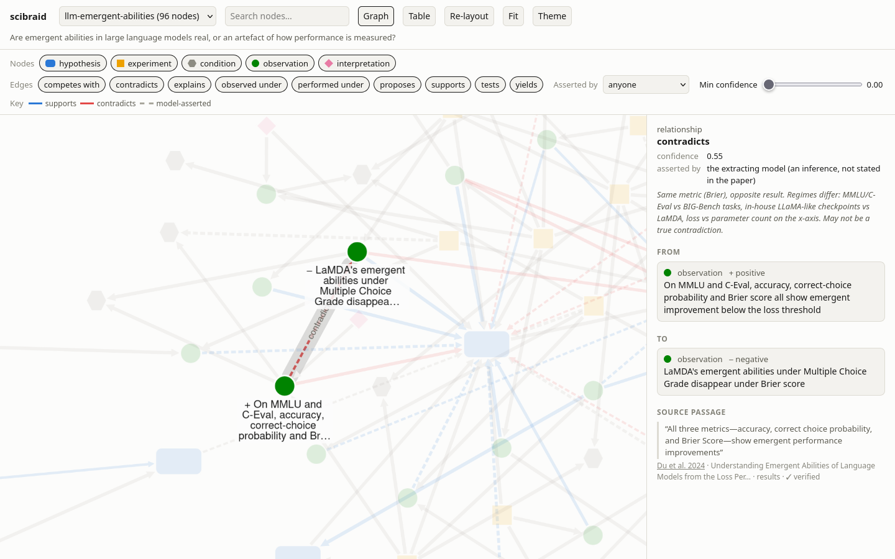

# scibraid

A researcher reviewing a literature builds a mental model of it: which experiments tested which hypotheses, under what conditions, with what results, and which of those results conflict. That model is the valuable product of the review. It is also private, and it is lost when the project ends. The next person to ask a nearby question starts again from the papers.

scibraid keeps the model. (The strands of a braid stay distinct, which is how its graphs are combined.) Given a research question, a coding agent reads the relevant papers and records what it finds as a small graph of hypotheses, experiments, conditions, observations and interpretations. Every link carries a confidence, a note of whether the paper's authors or the agent drew it, and a verbatim quote from the source. A tool checks each quote against the paper's text and rejects any that are not there, so the graph cannot cite evidence that does not exist. Failed replications and null results are recorded with the same care as positive ones, because they mark the parts of hypothesis space that have already been searched.

A single graph is useful on its own, from the first question, with nothing in the pool and no server. A corpus-wide graph is worth nothing until the corpus has been processed, and a shared platform is worth little until others have joined it. The first graph is already a literature review whose every claim can be checked: the hypotheses in contention, the evidence for and against each, the results that conflict and the conditions they were obtained under, each traceable to a quoted passage. `scibraid lint` points out what the review has missed, such as a hypothesis with no direct evidence or a search that turned up no failures, and `scibraid view` lets a reader browse it. Pooling adds to this later. It is not a precondition.

Graphs built for different questions are then pooled. They are never merged. A second pass judges which nodes in different graphs refer to the same thing and records each judgement as a link with its own rationale. The pooled structure can show things that no single review was looking for: a condition shared by failures in two unrelated lines of work, or a contradiction that disappears once the differing conditions are laid side by side. No one has to build a knowledge graph of science in advance: it grows from the questions people ask.

There are no API keys and no model calls in the code. The agent harness (Claude Code) does the reading and the judging through two skills. The `scibraid` command-line tool does everything that should be deterministic: literature search, schema validation, quote verification, storage, pooling, candidate ranking and the structural queries.

## Related work

Most scientific graphs take the paper as the node. [OpenAlex](https://openalex.org) and [Semantic Scholar](https://www.semanticscholar.org) link papers by citation and metadata. [scite](https://scite.ai) labels each citation as supporting, mentioning or contrasting the cited paper. These graphs say which papers are connected, not what experiment was run, under what conditions, or what it found.

Extraction pipelines go below the paper, to triples of entities. [SemMedDB](https://lhncbc.nlm.nih.gov/ii/tools/SemRep_SemMedDB_SKR.html) holds millions of subject-predicate-object statements mined from PubMed sentences, of the form "drug treats disease". [GraphRAG](https://github.com/microsoft/graphrag) and its descendants use a language model to do the same over any corpus, and [MR-KG](https://www.medrxiv.org/content/10.64898/2025.12.14.25342218) extracts structured evidence from 15,000 Mendelian randomisation studies. These systems process the whole corpus before anyone asks a question, which is expensive and fixes the schema to what the builders anticipated. A triple asserts a relation; it drops the experiment behind the claim and the conditions it was run under. A null result survives at best as a negated predicate, with nothing to say where the effect was absent.

Curated approaches keep more of the structure. The [Open Research Knowledge Graph](https://orkg.org) describes each paper's contribution as structured properties so that papers can be compared in a table. [Nanopublications](https://nanopub.net) package a single assertion with its provenance. [Discourse graphs](https://discoursegraphs.com) link questions, claims and evidence in a researcher's notes. scibraid shares their view that a claim should travel with its source. They depend on people doing the structuring by hand, and that has limited how much of the literature they cover.

The closest recent system is [ASKS](https://arxiv.org/abs/2608.29612) (2026), in which an agent compiles papers one at a time into a persistent graph, with deterministic checks on the model's output and links back to each source. It compiles a fixed corpus into one canonical graph of concepts and research directions. It is not driven by questions, and it integrates each paper into the shared graph as it goes.

The idea that pooling separate literatures reveals new connections is Don Swanson's. In 1986 he linked fish oil to Raynaud's syndrome through intermediate terms that appeared in two literatures which did not cite each other. Much of literature-based discovery since has joined literatures on shared terms or extracted triples. scibraid instead joins them on an experimental condition, which is more specific than a shared term and is where conflicting results tend to separate. Each link between graphs is judged on its own, and a bad one can be withdrawn.

## Example

Two questions were put to the agent separately:

```
/evidence-subgraph Are emergent abilities in large language models real, or an artefact of how performance is measured?
/evidence-subgraph Does chain-of-thought prompting only help above a certain model scale, and why?
```

The first produced a graph of 96 nodes and 158 links from 12 papers, the second 63 nodes and 103 links from 10 papers. Every quoted passage verified against the source text. The two graphs shared one paper and three node ids. The rest of the overlap was hidden behind different names: `c:model-family-palm` in one graph and `c:palm-models` in the other.

```
/align-subgraphs
```

The cheap stage proposed 56 cross-graph pairs. The agent judged 10 to be the same thing, 8 to be narrower or broader, 17 related and 21 different. The last group included traps that word overlap had ranked highly, such as "without instruction tuning" against "instruction-tuned".

`scibraid observe` then ranked, first among failures sharing a condition, one that neither question had asked about. Lu et al. (2024) found that emergent abilities mostly vanish in base GPT-3 when in-context learning is excluded. Wang et al. (2023) mention in a footnote that base GPT-3 175B gains little from chain-of-thought prompting. Both results sit under the condition "no instruction tuning". One comes from the emergence literature and one from the prompting literature. Together they suggest that instruction tuning, and not parameter count alone, gates both effects. That is a lead to follow up, not a finding. It took two ordinary literature reviews and one alignment pass to surface.

## Install

Requires [uv](https://docs.astral.sh/uv/) and Claude Code.

```sh
git clone <this repo> scibraid && cd scibraid
uv tool install --editable .        # puts `scibraid` on PATH
```

Inside this repository Claude Code finds the skills through `.claude/skills`. To use them elsewhere, load the repository as a plugin:

```sh
claude --plugin-dir /path/to/llm-sci-graph
```

## Use

Ask a question. The agent searches, reads, extracts paper by paper, checks its work with `scibraid lint`, reports what the evidence shows, and pools the result.

```
/evidence-subgraph why is the ego-depletion effect still disputed?
```

Browse what it built. Click any node or link to see the quoted passage, the confidence and who asserted it. The viewer is described below.

```sh
scibraid view
```

Once two or more graphs are pooled, align them and read the pool:

```
/align-subgraphs
```

```sh
scibraid observe
```

The tools can also be driven by hand. A batch is a JSON file of nodes and links (the format is in `skills/evidence-subgraph/SKILL.md`):

```sh
scibraid search "ego depletion replication" --limit 10
scibraid paper show W2499154041
scibraid new ego-depletion --question "Why is ego depletion still disputed?"
scibraid add ego-depletion batch.json
scibraid lint ego-depletion
scibraid pool ego-depletion
```

## Viewer

```sh
scibraid view
```

This serves one page on `http://127.0.0.1:8765/` and opens it. The page is rebuilt on every request, so refreshing the browser shows a subgraph as it is being built. `scibraid view -o graph.html` writes the same page as a standalone file with the data embedded.


Each node type has its own shape and colour: hypotheses, experiments, conditions, observations and interpretations. Links that support a hypothesis are blue and links that contradict one are red. A dashed link is one the agent inferred and the paper did not state. Line width shows confidence. With nothing selected, the side panel lists each hypothesis with a bar of the links for and against it, then the results that conflict with each other, then the papers.

Clicking a node or a link shows what it rests on. Below, the selected link says that one result contradicts another. The panel gives the confidence, records that the agent drew the link and the papers' authors did not, shows the agent's note on why the two results may not be in true conflict, and quotes the passage from the source with a mark that the quote was checked.



The nodes and links can be filtered by type, by who asserted them and by minimum confidence, and searched by text. A table view lists the same links in sortable rows. Choosing "All subgraphs together" draws the alignment verdicts between graphs, and selecting one shows its rationale. The address bar records the subgraph and the selection, so a view can be bookmarked or sent to someone running the same data.

The graph library, Cytoscape.js, loads from a CDN. Without a network connection the table and the side panel still work.

## Commands

| | |
|---|---|
| `search "<query>"` | search OpenAlex and cache papers with their abstracts |
| `paper show\|add\|text` | read a cached paper, add one from another source, attach full text |
| `new <slug> --question "..."` | start a subgraph |
| `add <slug> batch.json` | validate a batch and apply it, all or nothing |
| `show <slug> [--format summary\|json\|mermaid]` | print a subgraph |
| `lint <slug>` | experiments without conditions, hypotheses without evidence, no recorded failures, unverified quotes |
| `view [slug ...]` | browse in the browser; `-o file.html` writes a standalone page |
| `pool <slug>`, `pool --list` | add a subgraph to the pool |
| `candidates [--budget N] [--type T]` | rank unjudged cross-graph pairs by plausibility and consequence |
| `align add verdicts.json`, `align list` | record and list alignment verdicts |
| `observe [--format json]` | candidate observations from the aligned pool |

Data lives in `$SCIBRAID_HOME`, by default `~/.local/share/scibraid`.

## Data model

Nodes are `hypothesis`, `experiment`, `condition`, `observation` and `interpretation`. An observation has an outcome: positive, negative, null, inconclusive or mixed. Links are `tests`, `performed_under`, `yields`, `observed_under`, `supports`, `contradicts`, `explains`, `proposes`, `competes_with` and `fails_to_replicate`, each restricted to the node types it makes sense between.

A link is one paper's evidence for one relationship. The same relationship evidenced by a second paper is a second link, so evidence accumulates and a later source can weaken an earlier one. Observations are kept apart from interpretations because authors routinely run the two together in one sentence.

A quote must match the held text on word boundaries. Whitespace, case and quote style are ignored, and an ellipsis may elide words. A quote that cannot be checked because no text is held is accepted and marked unverified.

## Pooling and alignment

The pool is a local SQLite file. Node ids are namespaced by subgraph, and alignment adds links between subgraphs without altering them. A verdict is one of `same`, `broader`, `narrower`, `related` or `different`, with a confidence and a rationale. Only `same` at 0.7 or above joins nodes when `observe` reads the pool. `different` is stored too, so a rejected pair is not proposed again.

Candidate pairs are scored by lexical similarity, shared ids and shared papers, then weighted by how well connected both nodes are. The agent's judgement is the expensive step, and this ordering spends it where a match would join the most structure. Hypothesis pairs are always proposed, because paraphrase defeats lexical matching and they matter most.

Setting `SCIBRAID_POOL_URL` switches to a remote pool over HTTP (`/subgraphs`, `/alignments`). No server exists yet. The skills will not need to change when one does.

## Limitations

The comparison with related work draws on the author's knowledge of the field and a brief search. It is not a systematic survey, and the descriptions of other systems are from their public documentation.

The example graphs were built and aligned by the same agent in one session, so they were not independent in the way two researchers' graphs would be. No domain expert has audited the extractions. Quote verification shows that a passage exists. It does not show that the passage supports the link drawn from it.

An observation's outcome is relative to what its experiment was looking for, so "negative" does not mean the same thing across experiments, and `observe` treats it as if it did. OpenAlex keyword search misses core papers on narrow topics, and at least one of its records pairs the wrong abstract with a paper. Full text is fetched by the agent from open-access sources. Inline mathematics is lost when HTML is converted to text. The candidate stage is lexical, and embeddings would find matches it misses.

## Development

```sh
uv run pytest
```
