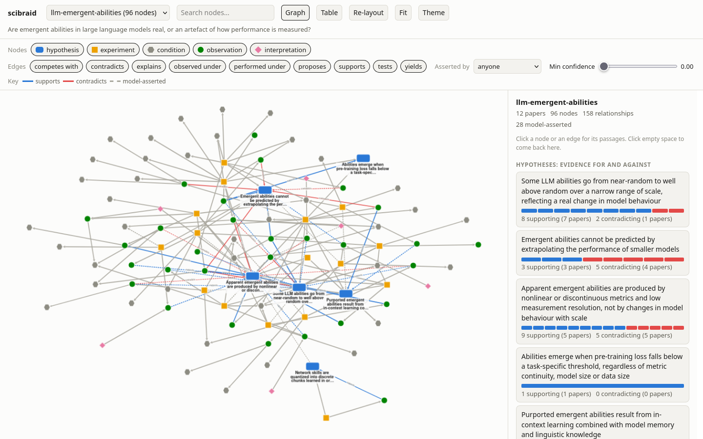

# scibraid

scibraid is a multi-agentic approach to literature review: agents build traceable evidence graphs from the scientific literature. Given a research question, they identify hypotheses, experiments, conditions and results, grounding each relationship in evidence from the original papers. Independent reviews can then be braided together to discover connections and contradictions that emerge only when different questions bring different parts of the literature into contact.



## Why?

A researcher reviewing a literature builds a mental model of it: which experiments tested which hypotheses, under what conditions, with what results, and which results conflict. That model is the valuable product of the review. It is also private, and usually disappears when the project ends. The next researcher asking a nearby question starts again from the papers.

**scibraid keeps the model.**

The strands of a braid stay distinct, which is how scibraid combines graphs without pretending that they are one canonical representation. Given a research question, an agent reads the relevant papers and records what it finds as a graph of hypotheses, experiments, conditions, observations and interpretations.

Every link carries:
- a confidence level
- whether the relationship was stated by the paper's authors or inferred by the agent
- a verbatim quotation from the source

A deterministic check verifies each quotation against the paper's text, where that text is held, and rejects quotations that cannot be found in it. This means the graph can be audited back to the evidence it claims to represent.

Failed replications and null results are recorded alongside positive results. They matter because they mark the parts of hypothesis space that have already been searched.

## The first review is already useful

scibraid does not require a corpus-wide knowledge graph to exist before it can answer a question.

A single graph is useful on its own. It is already a structured literature review whose claims can be inspected and traced to quoted passages: the hypotheses in contention, the evidence for and against them, conflicting results, and the conditions under which those results were obtained.

`scibraid lint` identifies structural gaps, such as hypotheses without direct evidence, experiments without conditions, missing failures and unverified quotations. `scibraid view` lets a reader browse the resulting review.

Pooling comes later. It is not a prerequisite.

## From separate reviews to new connections

Graphs built for different questions are pooled, but never merged. Each remains an independent representation of the question that generated it.

A second agent pass judges which nodes in different graphs refer to the same thing, recording each judgement as a link with its own rationale. The resulting structure can expose things that no individual review was looking for:

- a condition shared by failures in apparently unrelated lines of work
- a contradiction that the differing conditions of the two results may explain
- an experiment relevant to a hypothesis from another literature
- a hypothesis that has been tested under conditions relevant to another question
- experiments that have not yet been run

The key idea is that the system does not need to construct a universal ontology of science in advance. **The questions determine what gets represented; the points of contact between questions determine where further reasoning is worth doing.**

A third pass checks promising leads against the sources and wider literature. Each lead records what was checked, whether the connection held, whether it was already known or fell apart, and what question should be investigated next.

The process therefore forms a loop:

**question → agent-built review → alignment → candidate connections → verification → new question**

When a question reaches the point where the existing literature cannot settle it, scibraid records the open research question and the experiment that would resolve it.

## How it works

There are no language-model calls and no model API keys in the Python code itself. The only model it runs is the optional local embedding model. The agent harness, currently Claude Code, does the reading, extraction and judgement through three skills and one subagent that extracts a single paper. The `scibraid` command-line tool handles the deterministic parts:

- literature search and retrieval of open full text
- schema validation
- quote verification
- storage
- pooling
- candidate ranking
- structural queries

This separation is deliberate. The agent is used where interpretation is required; deterministic code checks and preserves the resulting structure.

## Related work

Most scientific graphs take the paper as the node. [OpenAlex](https://openalex.org/) and [Semantic Scholar](https://www.semanticscholar.org/) connect papers through citations and metadata. [scite](https://scite.ai/) goes a step further by classifying citations as supporting, mentioning or contrasting the cited work. These systems tell us which papers are connected, rather than what experiment was run, under what conditions, or what it found.

Extraction pipelines go below the paper to triples of entities. [SemMedDB](https://lhncbc.nlm.nih.gov/research/informatics/semmed/) contains large numbers of subject-predicate-object statements mined from PubMed. [GraphRAG](https://github.com/microsoft/graphrag) and related systems use language models to extract similar structures from arbitrary corpora. [MR-KG](https://www.medrxiv.org/content/10.64898/2025.12.14.25342218) extracts structured evidence from Mendelian randomisation studies.

These approaches generally process a corpus before a specific research question is asked. That makes them expensive to build and means the schema must anticipate the questions researchers will eventually ask. A simple triple also loses the experimental context behind a claim: which experiment produced it and under what conditions. A null result survives at best as a negated predicate, with nothing to say where the effect was absent.

Curated approaches preserve more of this structure. The [Open Research Knowledge Graph](https://orkg.org/) represents papers through structured properties so that contributions can be compared. [Nanopublications](https://nanopub.net/) package assertions together with provenance. [Discourse graphs](https://discoursegraphs.com) represent questions, claims and evidence in researchers' notes.

scibraid shares their emphasis on provenance, but uses agents to construct the structure from the literature rather than requiring people to do the extraction by hand.

The closest recent system is [ASKS](https://arxiv.org/abs/2608.29612), which uses an agent to compile papers into a persistent graph with deterministic checks and links back to source material. scibraid differs in making the **research question**, rather than a fixed corpus, the unit around which the graph is built. Separate question-driven graphs remain distinct and are aligned only when there is a reason to compare them.

The broader idea of discovering connections by combining otherwise separate literatures goes back to Don Swanson's work on literature-based discovery. scibraid follows that tradition but looks for a more specific kind of connection: **shared experimental conditions**, rather than merely shared terms. Conditions are often where apparently conflicting results separate.

## Example

Two questions were put to the agent separately:

```text
/evidence-subgraph Are emergent abilities in large language models real, or an artefact of how performance is measured?
/evidence-subgraph Does chain-of-thought prompting only help above a certain model scale, and why?
```

The first produced a graph of 96 nodes and 158 links from 12 papers. The second produced 63 nodes and 103 links from 10 papers. Every quoted passage was verified against the source text.

The two graphs shared one paper and three node IDs. Other overlaps were hidden behind different names, such as `c:model-family-palm` in one graph and `c:palm-models` in the other.

```text
/align-subgraphs
```

The cheap candidate stage proposed 56 cross-graph pairs. (At the time it proposed every pair of hypotheses; it no longer does, for the reason given under Pooling and alignment.) The agent judged 10 to be the same thing, 8 narrower or broader, 17 related and 21 different. The last category included plausible-looking lexical matches that turned out to be conceptually different.

`scibraid observe` then surfaced a failure shared by two lines of work that neither original question had asked about. Both results concerned base models without instruction tuning. One came from the emergent-abilities literature and one from the prompting literature.

The third pass checked the observation and related candidates against the sources. That connection turned out to be in the literature already: one of the two papers makes its remark "echoing Fu et al. (2022)", an essay that traces chain-of-thought ability to how a model was trained and not to its size. The pool had recovered it from two papers that do not frame it that way. Of the other candidates, one held and one fell apart under closer inspection. The system keeps those outcomes too, so a rejected lead is not rediscovered and pursued again.

The important result is not that every candidate is an insight. Most are not. The point is to create a **searchable space of cross-literature hypotheses**, then spend expensive agent reasoning and source checking on the connections where the structure suggests it may pay off.

## Install

Requires `uv` and Claude Code. Reading PDFs uses `pdftotext` from poppler if it is installed, and otherwise needs the `fulltext` extra.

```bash
git clone <this repo> scibraid && cd scibraid
uv tool install --editable ".[embeddings]"
```

Literature search uses [OpenAlex](https://openalex.org/), which needs no account. Requests without a key share one free daily budget per IP address, and a day of building subgraphs can exhaust it, so get a free key and either set `OPENALEX_API_KEY` or put the key in `~/.openalex-tok` (another path can be named in `OPENALEX_API_KEY_FILE`). A file is the easier of the two, because every session and subagent on the machine finds it.

The `embeddings` extra adds a small local embedding model (fastembed, about 70 MB on first use, no API key) to help the alignment stage find matching conditions that share no words. Leave it off and the system still works using word overlap.

Inside this repository Claude Code finds the skills and the extractor agent through `.claude/skills` and `.claude/agents`. To use them elsewhere, load the repository as a plugin:

```bash
claude --plugin-dir /path/to/scibraid
```

## Use

Ask a question. The agent frames the hypotheses in contention, searches, fetches open full text, hands each paper to an extractor subagent, and then draws the links that span papers itself. It checks the result with `scibraid lint`, reports what the evidence shows, and can pool it with other reviews.

```text
/evidence-subgraph why is the ego-depletion effect still disputed?
```

Anything written after the question frames it: hypotheses you want tested, a distinction every paper should be read for, literatures that bear on it under other names. The agent records that framing on the subgraph (`scibraid show` prints it) and adds the rival hypotheses you did not give.

```text
/evidence-subgraph Does telling LLM agents that their partner is a copy of the same model change how they coordinate?
Test these: identity alone does the work; common knowledge of it is required; belief alone suffices.
Keep apart whether the partner was the same model and whether the agents were told so.
Cover superrationality and program equilibrium, not only papers about LLMs.
```

Browse what it built:

```bash
scibraid view
```

Once two or more graphs have been pooled:

```text
/align-subgraphs
/pursue-leads
```

You can then inspect what the aligned pool suggests:

```bash
scibraid observe --new
scibraid lead list
scibraid followups
scibraid agenda
```

A lead can seed the next review:

```bash
scibraid new graded-cot-metrics --lead cot-threshold-never-scored-with-graded-metric
```

The tools can also be driven by hand. A batch is a JSON file of nodes and links; the format is documented in `skills/evidence-subgraph/SKILL.md`.

```bash
scibraid search "ego depletion replication" --limit 10
scibraid search "replication" --citing W2499154041   # among the works that cite a paper
scibraid paper get 10.1177/1745691616652873          # a paper you already know of, by DOI or arXiv id
scibraid paper show W2499154041
scibraid fetch W2499154041                           # attach open full text, if there is any
scibraid new ego-depletion --question "Why is ego depletion still disputed?"
scibraid add ego-depletion batch.json
scibraid lint ego-depletion
scibraid pool ego-depletion
```

## Viewer

```bash
scibraid view
```

The viewer opens a local page at `http://127.0.0.1:8765/`. It shows hypotheses, experiments, conditions, observations and interpretations as distinct node types.

Every quoted passage links to its paper. The citation opens a paper panel with links out to the paper, its DOI, arXiv and OpenAlex, the abstract, a BibTeX entry with a copy button, and every relationship in the graph that rests on that paper, which are highlighted. The papers list has buttons to copy all the BibTeX or download it as a `.bib` file.

Selecting a link reveals the evidence behind it: its confidence, whether it was asserted by the paper or inferred by the agent, the agent's rationale, and the source passage used to support it.

Graphs can be filtered by node type, who asserted a relationship and confidence. Choosing "All subgraphs together" shows the local graphs side by side with the pool's alignment judgements between them and the rationale behind each. Leads show the evidence and checks on which they depend.

## Commands

| Command | Purpose |
|---|---|
| `search "<query>"` | Search OpenAlex by title and abstract, and cache the results with their abstracts and whether an open copy exists |
| `search --citing <id>` / `--references-of <id>` | Search among the works that cite a paper, or among its references |
| `paper get <identifier>` | Cache a paper's OpenAlex record by DOI, arXiv id or URL, PubMed id or OpenAlex id. An arXiv id is checked against arXiv's own title |
| `paper reid <old id> [identifier]` | Give a hand-added paper its OpenAlex record in every subgraph and lead that cites it, keeping the text its passages were checked against |
| `paper show\|add\|text` | Read a paper, add one OpenAlex lacks, or attach full text by hand |
| `fetch <id ...> \| --subgraph <slug>` | Find an open copy (arXiv HTML, Europe PMC, PDF) and attach its full text |
| `new <slug> --question "..." [--hypothesis ...] [--condition ...] [--brief ...]` | Start a subgraph, recording how the question is framed |
| `frame <slug> [--hypothesis ...] [--condition ...] [--brief ...]` | Add to the framing of an existing subgraph |
| `add <slug> batch.json` | Validate and apply a batch |
| `show <slug> [--format summary\|json\|mermaid]` | Inspect a subgraph |
| `lint <slug>` | Find structural gaps and unverified evidence |
| `duplicates <slug>` | List conditions and hypotheses within a subgraph that may be one thing under two ids |
| `merge <slug> <keep> <drop>` | Fold one node into another, moving its links and passages |
| `view [slug ...]` | Browse a graph in the browser |
| `pool <slug>` | Add a subgraph to the pool |
| `candidates [--budget N] [--type T] [--lexical]` | Rank unjudged cross-graph pairs |
| `hypotheses` | Show hypothesis lists for pooled subgraphs |
| `align add\|list` | Record or inspect alignment judgements |
| `observe [--new]` | Find candidate observations in the aligned pool |
| `lead add\|list` | Record or inspect checked leads |
| `followups` | Show follow-up questions raised by leads |
| `agenda` | Show open research questions, the experiment each needs, and whether the literature already poses it |
| `bibtex [slug ...] [-o refs.bib]` | BibTeX for the papers the subgraphs cite, generated from cached metadata |
| `builder add <slug> --person --model ...` | Record who built a subgraph made before builders were recorded |
| `repair list\|resolve` | List and resolve faults in subgraphs or judgements found while checking leads (recorded on the lead) |

The commands that list things take `--format markdown` and print tables that paste into a README, an issue or a note: `list`, `pool --list`, `show`, `candidates`, `align list`, `lead list`, `followups`, `agenda`, `repair list` and `observe`. Most also take `--format json`.

```bash
scibraid agenda --format markdown
```

Data lives in `$SCIBRAID_HOME`, by default `~/.local/share/scibraid`. Several sessions can work against it at once. Each should build its own subgraph; the pool is SQLite and locks itself, files are written atomically, additions to one subgraph are serialised by a file lock, and a lead edited from a stale copy is refused. The file lock is advisory and local, so it does not protect a data directory shared over a network file system.

## Data model

The core graph contains five node types:

- `hypothesis`
- `experiment`
- `condition`
- `observation`
- `interpretation`

Links describe relationships such as `tests`, `performed_under`, `yields`, `observed_under`, `supports`, `contradicts`, `explains`, `proposes`, `competes_with` and `fails_to_replicate`.

Each piece of evidence remains attached to the paper that provides it. If two papers support the same relationship, they create two links rather than one aggregated fact. This allows later evidence to strengthen, qualify or weaken an earlier claim.

Observations are kept separate from interpretations because papers often combine the two in a single sentence.

A quote must match the held source text. If the source text is unavailable, the quote is marked unverified rather than silently treated as checked.

## Pooling and alignment

The pool is a local SQLite database. Subgraphs remain namespaced and unchanged; alignment adds links between them.

Each alignment judgement is one of:

`same`, `broader`, `narrower`, `related`, `different`

and carries its own confidence and rationale.

Candidate matches are ranked using word overlap, shared identifiers, shared papers and, when enabled, embedding similarity. The agent makes the final judgement. This lets the cheap matching stage narrow the search space before expensive semantic judgement is applied.

The system does not rely on similarity to relate hypotheses. Similarity finds restatements of one claim. Whether two hypotheses bear on each other is a substantive research judgement, not a text-similarity problem, and on three pooled subgraphs neither word overlap nor embeddings ranked the related pairs better than chance. So `scibraid hypotheses` gives the agent both lists to read in context.

`observe` searches the aligned structure for patterns such as:

- conditions reached from different questions
- failures sharing a condition
- experiments that may bear on another question's hypothesis
- contradictions whose differing conditions may explain the disagreement
- hypotheses linked across questions
- experiments that have not yet been run

Most such patterns are not discoveries. A **lead** is a pattern that has been written down to be checked. Its status is `candidate` until it has been: the tool will not accept any other status without recorded checks. After checking it is `holds` (the premise is verified, no duller explanation was found, and a brief search did not find the connection stated), `known` (the literature already says it), `refuted`, or `open`. `open` is reserved for an open research question: the literature has been reviewed and does not settle the claim, so only new empirical work can. Open is a judgement made by this process, not a statement that the field regards the question as open, and it is not the same as new. Each open lead therefore records where the literature already poses the question (`posed_in`), or that a search found it posed nowhere, and `scibraid agenda` lists first the questions that nobody was found to have asked. A lead cannot be more confident than the weakest alignment judgement it rests on.

Each lead records the claim, the graph elements and alignment judgements it depends on, the checks performed, what would confirm or refute it, and a follow-up question.

The loop therefore preserves not only what the literature says, but also what the system considered, checked, rejected and left unresolved.

## Who did the work

Agreement between two subgraphs counts as confirmation only if they were read independently, and a lead checked by whoever built its evidence has not had a second reader. So every subgraph records its builders, every alignment judgement its judge and every lead its checker: the person, the agent harness, the model and the session. The tool takes the person, harness and session from the environment. It cannot see the model, so the agent passes `--model`.

Independence is reported as one of four levels, weakest first: `unknown` (nothing recorded, which counts as not independent), `same reader` (same person and model, even in a new session), `same model` (different people, one model, so shared blind spots), and `different model`. `observe` gives the level for each candidate that spans subgraphs, and `agenda` gives it for the checker of each open question against the builders of its evidence.

## Which model does what

The steps do not all need the same model. Reading one paper and recording what it did is the bulk of the tokens, and the tool checks that work: every quoted passage must appear in the source. Deciding what several papers mean together is a small share of the tokens, and nothing checks it.

So the `evidence-subgraph` skill hands each paper to a `paper-extractor` subagent, which runs on Sonnet with a fresh context and one paper in front of it, and records its own model on what it adds. The session's model frames the question, retrieves, and then makes a synthesis pass over the extracted graph: it merges ids that parallel extractors minted twice (`scibraid duplicates`, `scibraid merge`) and draws the links that span papers. Hypothesis alignment and `pursue-leads` stay on the session's model.

This split comes from one comparison, not a benchmark. Three models extracted the same five papers for the same question. Sonnet recorded 92 links to the top model's 36, five conditions per experiment to its three and eight failures to its one, and caught an error in the top model's reading of one paper. Haiku had 6 of its 13 batches rejected, recorded one failure, rated its own links at a mean confidence of 0.90, and lost the claim under test: each of its ten hypotheses restated one paper, and none was evidenced by more than one. Sonnet connected the papers as well as the top model had. The synthesis pass sits with the session's model for a structural reason: extractors that each see one paper cannot link two.

A useful side effect is that a subgraph extracted by one model and checked by another has had a second reader of a different kind, which `agenda` and `observe` report.

## Limitations

The current system is a research prototype.

- A check that a lead is already known, or that a question has already been asked, is a brief agent search, not a systematic literature review. `holds`, `open` and "not found posed anywhere" therefore mean that nothing was found, not that nothing exists.
- Quote verification establishes that a passage exists in the source. It does not establish that the passage actually supports the relationship the agent attached to it.
- The example graphs were built and aligned by the same agent in one session, so they are not independent in the way reviews produced by different researchers would be. The tool now reports this (`same reader`) instead of leaving it to be remembered.
- The model tiers rest on a single five-paper comparison on one question. Whether alignment, or the checking of leads, can also move to a cheaper model has not been tested, so both stay on the session's model.
- Builders are recorded per subgraph, not per link, so a subgraph that two readers contributed to counts as the weaker of the two everywhere.
- No domain expert has audited the example extractions.
- The example comparison with related work is based on the author's knowledge and a brief search rather than a systematic survey.
- Framing steers a review towards what its author expected. The framing is recorded and the skill requires rival hypotheses, but nothing checks that the rivals were sought as hard as the favoured ones.
- Word search finds a minority of the relevant papers. Three hand-written queries per question, top 25 results each, returned 20 of the 62 papers the six example subgraphs cite; the rest were found through reference lists and the agent's own knowledge. Following citations (`--citing`, `--references-of`) is the remedy the skill prescribes, and its effect has not been measured.
- OpenAlex's default search also matches full text, which it holds only for open papers: on the same queries 2% of its results were closed, against 19% when matching on title and abstract, which is now the default. Recall was the same either way (18 and 20 of 62).
- OpenAlex files a few unrelated records under the arXiv DOIs of well-known papers (2 of the 22 arXiv ids tried, one of them Wei et al.'s chain-of-thought paper). `paper get` checks an arXiv id against arXiv's own title and then looks for the paper by title. A DOI that is not an arXiv DOI is not checked.
- OpenAlex metadata can contain errors. BibTeX is generated from that metadata: author lists are stored cut at eight names (the entry then ends "and others"), and venues and entry types should be checked before use.
- Full text comes only from open copies. A closed paper is found by search and can be extracted from its abstract, but its body is unread unless someone attaches the text by hand, so `open` and "not found posed anywhere" describe the literature that could be read. The share that is closed varies widely by field and rises with age; it was about two thirds for one materials-science query.
- Text taken from a PDF loses section headings and mangles mathematics. Some publishers refuse automated requests even for open papers, and `fetch` then reports the failure.
- An observation inherits every condition recorded for its experiment, including ones that do not apply to it, which produces spurious shared-condition patterns.
- A condition that a paper used but the agent did not record looks the same as a condition that was never tested, which produces spurious "experiments that have not been run".
- An observation's outcome is relative to what its own experiment was looking for, so two "negative" results can point in opposite directions. `observe` treats them as comparable.
- The candidate stage finds nodes that look alike. It does not solve the harder problem of discovering whether two hypotheses bear on each other. The current system asks the agent to reason over hypothesis lists instead.
- Scaling alignment across hundreds of subgraphs will require better strategies for deciding which graphs and which node pairs are worth comparing.

## Development

```bash
uv run pytest
```

## Design principle

scibraid is built around a simple inversion:

**Don't build a knowledge graph of the literature and then ask questions of it. Let research questions build the parts of the graph that matter, and connect those graphs when new questions make the connections useful.**

That makes the evidence graph a by-product of research rather than a prerequisite for it.
